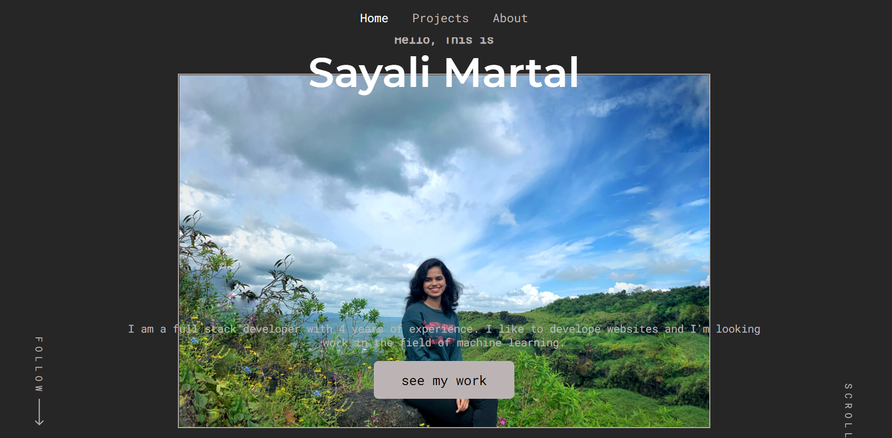

# Portfolio website [React Project]

## Live Preview: [https://sayalimartal.netlify.app/][preview]

## Project Details

This is code for my porfolio. I've used React JS for this project. This is a fully responsive design including all my personal information.

## Technologies / libraries used

- React JS
- CSS
- HTML
- Flexbox
- Smooth Scroll
- Switch Transition
- React Icons

## Commands to install dependencies and run the code

- npm install
- npm start
